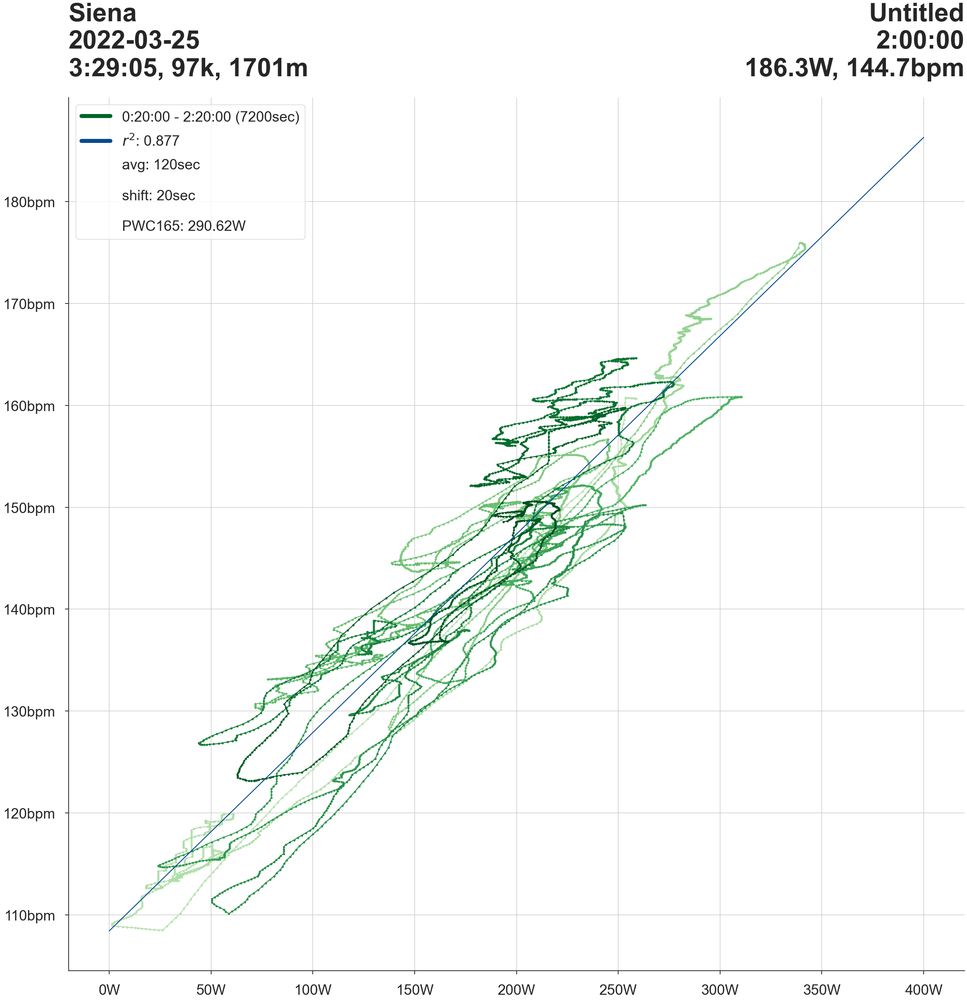

## Strava App for Heart Rate / Power Analysis
* Strava API:
  * Deploy App
  * Athlete Data Permission
  * Fetch Full Activity Data Stream
* Pandas: Clean HR / Power Data
* Jupyter Notebook:
  * Timeframe / Segment Selection
  * HR / Power Delay ("shift")
  * Rolling Average (window size "avg")
  * Regression Analysis & R-squared
  * Physical Working Capacity (PWC) at given HR
* Matplotlib: Charts

